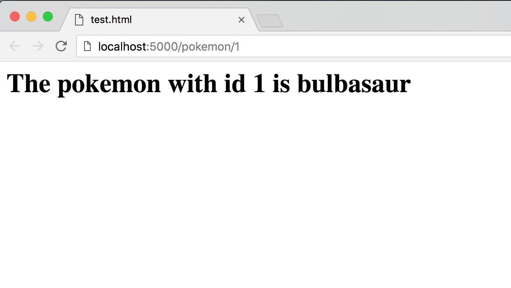
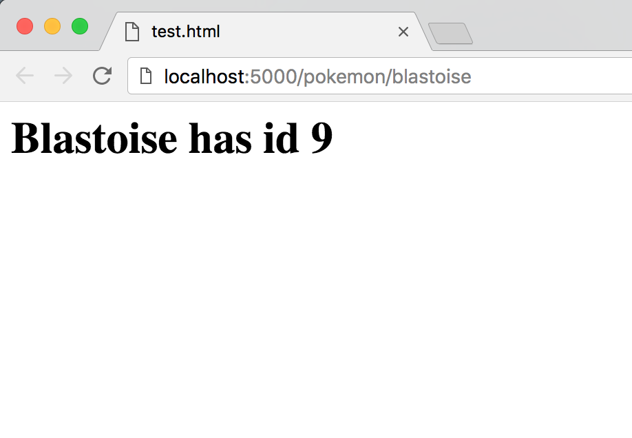

ADI Labs Technical Challenge
===================

We're excited to see that you're interested in joining ADI Labs for the Fall 2018 semester!

In Labs, we build products that are deployed and used by hundreds of students here at Columbia and beyond. To make sure you have enough technical experience to join the team, we've put together a quick technical challenge to assess your ability to use Flask, HTML/CSS, and Git/GitHub.
This challenge should take about 30 minutes to complete and requires Python 3 (a minimal amount), a basic text editor (ex. Sublime or TextEdit), Git (pre-installed on most computers), and a GitHub account. Please complete this challenge on your own.

----------

The Problem
-------------

ADI wants to showcase some of the awesome students here at Columbia. We want to make a webpage for each student with their name and their favorite picture. However, the ADI committee has been procrastinating by watching reruns of Pokemon episodes and their other favorite shows on Netflix.

That's where you come in; we need your help adding a page dedicated to you on our new showcase website.

Task 1
-------------
Fork this repository.

Task 2
-------------
Create a new HTML page.
You must include:
- Your name
- A picture of yourself
- A link to your favorite website
- A description of your hobbies and interests

In addition, your website must incorporate some form of styling that makes it mobile-friendly. A standard toolkit for this is [Bootstrap](https://getbootstrap.com/). The look of your site is up to you, but it should be clear and easy for a person to view. Have fun and be creative with the design!

Task 3
-------------
Extend the [Flask](http://flask.pocoo.org/docs/0.12/quickstart/)  app so that going to the endpoint "/" + your uni will return the HTML page you created in task 2. (For example, if your uni was lcb50, you would make your HTML page visible at `localhost:5000/lcb50`)

Task 4
-------------
Commit all of the changes you have made and push them to the fork of this repo you made on GitHub. Verify that your changes are visible.

Task 5
-------------
Create a new branch from `master` and name it `dev`. On this branch, create a dynamic endpoint called `/pokemon`. A user queries this endpoint but giving either an id or a name. Your task is given an id or a name, display the name or id of that pokemon respectively on your webpage. According to [pokeapi](https://www.pokeapi.co/),
> Pokémon are the creatures that inhabit the world of the Pokémon games. They can be caught using Pokéballs and trained by battling with other Pokémon.

For example, if I navigate to `localhost:5000/pokemon/1`, my page might look like the following:

Similarly, if I navigate to `localhost:5000/pokemon/blastoise`, my page will look like the following:

You will find these libraries and websites to be useful:
- [Requests](http://docs.python-requests.org/en/master/)
- [PokeAPI](https://www.pokeapi.co/) and specifically [this page](https://www.pokeapi.co/docsv2/#pokemon)

Task 6
-------------
Commit your changes and push the new branch to your forked repository. Make sure that the changes are visible on the forked branch.

Task 7
-------------
When you've completed the above steps, go to the link of your forked repo that shows all the requested changes. Copy that link into your ADI Labs application. Once you've successfully completed that, you're done. Thanks for completing the Labs Tech Challenge!

Questions
-------------

If you have any questions about this challenge and/or Labs, reach out to us at [labs@adicu.com](mailto:labs@adicu.com).
